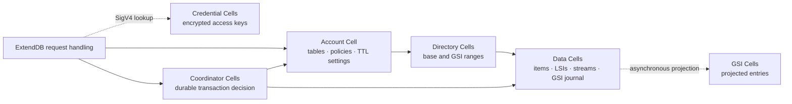

# BeyondDB

BeyondDB is an **in-progress, self-hosted DynamoDB-compatible service**. It
uses [ExtendDB](https://github.com/ExtendDB/extenddb) for the DynamoDB HTTP
protocol, SigV4, IAM evaluation, validation, and expressions. It uses
[Cellule](https://github.com/crabbuild/cellule) for fenced Cell ownership,
SQLite execution, LTX publication, and object-store durability. The reviewed
dependency revisions are pinned in [Cargo.toml](Cargo.toml).

An AWS SDK can send signed requests to BeyondDB's public endpoint. Core table
and item operations, transactions, TTL, selected secondary indexes, and a
partial Streams path have durable Cell implementations and focused restart
tests. **BeyondDB is not yet a complete or production-qualified DynamoDB
replacement.** See the [API coverage and gaps](docs/api.md) before choosing a
workload.

## Start here

| Need | Read |
| --- | --- |
| Configure and start a node | [Deployment guide](docs/deployment.md) |
| Send AWS CLI requests | [User guide](docs/user-guide.md) |
| Check an operation or limitation | [API coverage](docs/api.md) |
| Understand Cells, routing, and transactions | [Architecture](docs/architecture.md) |
| Measure latency and throughput | [Performance guide](docs/performance.md) |
| Follow implementation evidence and open gates | [Implementation status](docs/implementation-status.md) |

## Architecture at a glance


ExtendDB owns the public HTTP, SigV4, IAM, validation, and expression layers.
BeyondDB implements ExtendDB's storage contracts with Cell-backed state,
routing, provisioning, and transaction coordination. Cellule owns fenced Cell
execution, peer transport, SQLite commands, and LTX publication. The object
store holds published roots for owner recovery. [PNG version](diagram/beyonddb-architecture/layers@2x.png)

### BeyondDB's Cell types



Each box represents BeyondDB state hosted in Cellule, not an independent
HTTP service. An account Cell owns table metadata; data Cells own
partition-key ranges. A GSI is maintained asynchronously from a journal
committed with the base item. Cross-Cell transactions use a durable
coordinator decision and idempotent participant resolution.

### Choose placement per table

Set the `CreateTable` tag `beyonddb:cell-model` to `single`, `auto`, or `partitioned`. Keep one base data Cell for a table that fits its resource budgets, start at one and permit growth, or provision multiple ranges immediately. Omitting the tag preserves `initial_partitions`. GSIs use separate Cells; changing the tag later does not migrate the table. See [Cell model selection](docs/scaling.md#choose-a-tables-cell-model) and the [AWS CLI example](docs/user-guide.md#create-a-table-and-wait-for-it).

### When a write becomes durable


A partition-local mutation, its result, LSI changes, GSI journal entry, and
stream intent commit in one Cell command. The successful response follows
durable publication. [PNG version](diagram/beyonddb-architecture/durable-write@2x.png) ·
[Detailed architecture and recovery design](docs/architecture.md)

The default serving path waits for object-store publication on each durable
write. Experimental `follower_durability_enabled` installs Cellule's node-log
provider and can acknowledge after every enrolled follower fsyncs the commit.
A three-process signed SDK test verifies item mutations, same-partition
transaction replay, and stream records after an owner kill with object uploads
withheld. Broader fault and performance qualification remains open. See the
[follower durability guide](docs/follower-durability.md).

## Current capability boundary

| Area | Current state |
| --- | --- |
| Tables and items | Create/describe/list/update/delete tables; keyed CRUD, Query, Scan, batches, conditions, expressions, and pagination have Cell paths. Some `CreateTable` and `UpdateTable` options are rejected. |
| Transactions | `TransactWriteItems` and `TransactGetItems` use durable coordination across Cells, with signed SDK restart tests. |
| Indexes | LSIs support `ALL` projection. GSIs created with a table support `ALL`, `KEYS_ONLY`, and `INCLUDE` through asynchronous projection. Online GSI changes and non-`ALL` LSI projections remain unsupported. |
| TTL and Streams | TTL settings and bounded expiry sweeps are Cell-backed. A stream enabled at table creation can journal writes and expose current and retained generations. Bounded retention sweeps cover active and dormant data Cells; stream policy updates and full lifecycle qualification remain open. |
| Operations | Backup, restore, PITR, account/IAM management, and safe data-format upgrades remain unfinished. Fleet-scale throughput and unattended recovery are unqualified. |
| Other DynamoDB features | PartiQL and Global Tables are not dispatched by pinned ExtendDB. Its local-file import/export extensions do not implement DynamoDB's S3 workflow; BeyondDB disables them. |

The table is a guide, not a blanket compatibility claim. The
[API matrix](docs/api.md) distinguishes implemented methods from operations
verified through signed SDK requests and owner restart.

## Minimal client example

After following the [deployment guide](docs/deployment.md), configure an
account's access key and point the AWS CLI at the public listener:

```sh
export AWS_ACCESS_KEY_ID='your-bootstrapped-key-id'
export AWS_SECRET_ACCESS_KEY='your-bootstrapped-secret'
export AWS_DEFAULT_REGION='us-east-1'
export AWS_CA_BUNDLE='/etc/beyonddb/public-ca.crt'
export BEYONDDB_ENDPOINT='https://ddb.example.com:8000'

aws dynamodb list-tables --endpoint-url "$BEYONDDB_ENDPOINT"
```

The CA bundle must trust the public listener certificate. A loopback listener
without TLS uses an `http://` endpoint and does not need `AWS_CA_BUNDLE`.
For runnable table and item commands, see the [user guide](docs/user-guide.md).

## Development and qualification

The ordinary test suite excludes ignored process tests. The latter start a
RustFS fixture, use signed AWS SDK calls, kill the server, and read committed
state after fenced recovery. They require Docker, the AWS CLI, and OpenSSL.
Use a unique target directory under `$HOME/Workspace/crabbuild-target` on
workstations with the mounted Workspace volume.

```sh
export CARGO_TARGET_DIR="$HOME/Workspace/crabbuild-target/beyonddb-docs-3c23"
cargo fmt --check
cargo clippy --all-targets -- -D warnings
cargo test --lib
cargo test --test server_binary -- --ignored --test-threads=1
```

The [independent client qualification instructions](docs/implementation-status.md#independent-client-qualification)
run ExtendDB's Python protocol tests against the BeyondDB binary. Passing
selected tests does not establish full DynamoDB compatibility. For scale
claims, use the [measured completion gates](docs/scaling.md#completion-proof).

## Design and evidence

- [Cross-Cell transaction protocol](docs/cross-cell-transactions.md)
- [Metadata ownership](docs/metadata-sharding.md)
- [Global secondary indexes](docs/global-indexes.md)
- [Streams contract](docs/streams-contract.md)
- [Local secondary index contract](docs/lsi-contract.md)
- [Scaling and measured limits](docs/scaling.md)

BeyondDB is licensed under Apache-2.0. Its contributor invariants are in
[AGENTS.md](AGENTS.md).
