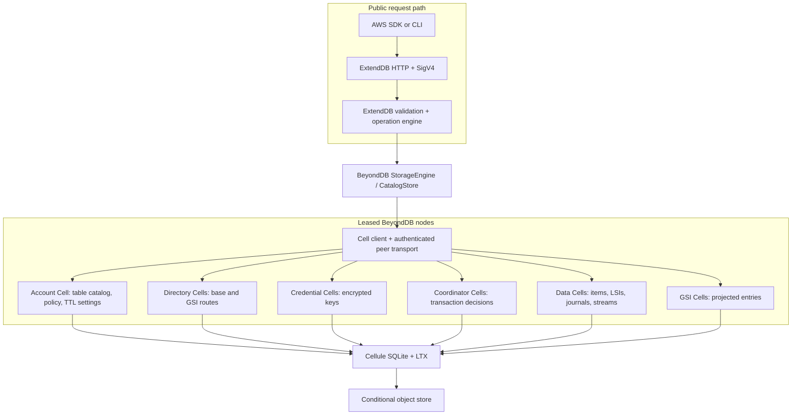
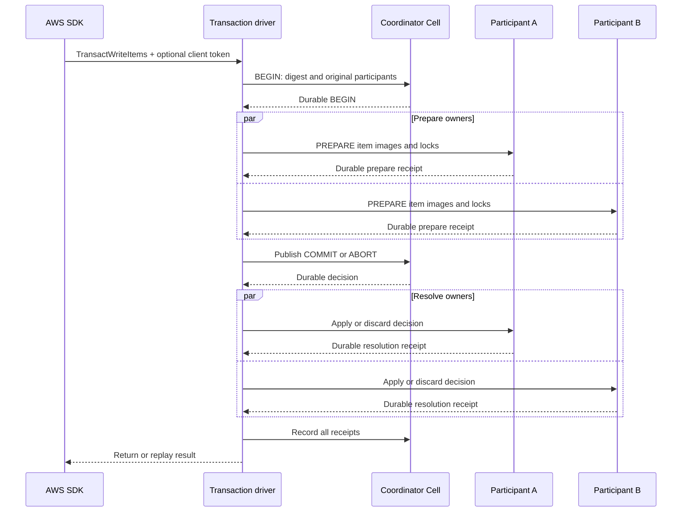
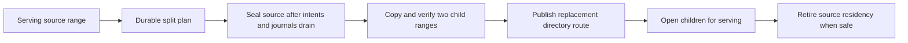
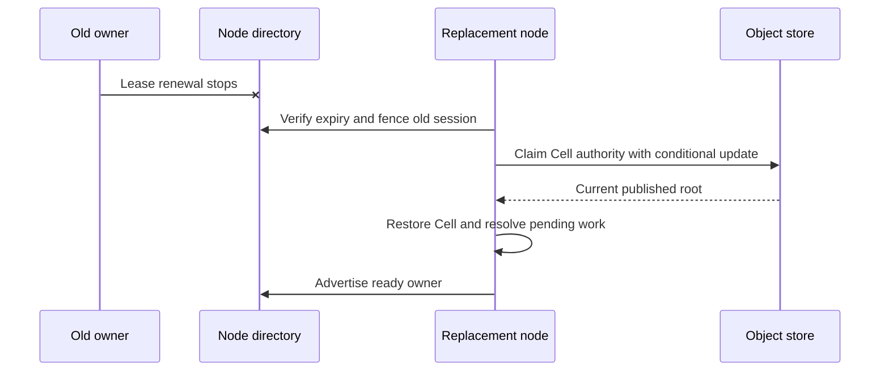

# Architecture and durability design

BeyondDB composes two pinned projects. ExtendDB owns the public DynamoDB
protocol and security boundary. Cellule owns fenced execution and publication.
BeyondDB supplies the Cell schemas, `StorageEngine`/`CatalogStore` adapters,
routing, provisioners, transaction coordinator, and serving workers. This is
an implementation description, not a fleet-scale performance claim.

```text
AWS client -> ExtendDB HTTP/auth/engine -> BeyondDB adapter -> Cell owner
                                                       |        |
                                                       |        +-> SQLite command
                                                       |              -> LTX -> object store
                                                       +-> peer mTLS when owner is remote
```

## Components and ownership



The server takes an S3, GCS, or Azure object-store URL and uses a separate
scratch directory per node session. The object store must support strict
create and conditional updates for Cell authority. The public listener may
forward a signed request to the current Cell owner over private mTLS; the
receiving node still checks owner authority. The encryption key file protects
stored access secrets and must survive node restarts.

| State | Authority and atomic boundary |
| --- | --- |
| Account metadata and IAM policies | One account Cell command for each account-local mutation. The account still owns the table-name catalog and publication anchors. |
| Base items and LSIs | One data-range Cell owns a partition-key hash interval. A write, its LSI changes, GSI journal entry, and stream intent share one command. |
| GSIs | Separate range Cells receive journal projections asynchronously and idempotently. Their read view can lag a base write. |
| Transactions | One durable coordinator records a participant set and COMMIT or ABORT decision. Each account/data participant stores prepare state and resolves that decision idempotently. |
| Credentials | Key-derived credential Cells store encrypted secrets and session tokens. |

## Single-item write sequence

```mermaid
sequenceDiagram
    participant Client as AWS SDK
    participant HTTP as ExtendDB endpoint
    participant Route as BeyondDB router
    participant Owner as Data Cell owner
    participant Store as Object store
    Client->>HTTP: Signed PutItem
    HTTP->>HTTP: SigV4, IAM, validation, expressions
    HTTP->>Route: StorageEngine.put_item
    Route->>Owner: Command for table generation and range epoch
    Owner->>Owner: Check condition; update item, LSI, journal, stream
    Owner->>Store: Publish LTX and current root
    Store-->>Owner: Conditional publication succeeds
    Owner-->>HTTP: Committed result
    HTTP-->>Client: DynamoDB JSON response
```

A rejected command rolls back its SQLite transaction. A successful mutation
response follows durable publication. The router must use the current table
generation, range, and owner epoch; stale routes are rejected and refreshed.
`GetItem` and Query/Scan read the owning Cell, respecting unresolved
transaction intents.

## Cross-Cell transaction sequence



The original coordinator and participant identities survive routing changes.
If a driver dies after decision publication, startup or serving recovery can
finish participant resolution. A caller timeout is an unknown outcome until
the durable decision is inspected; the client token distinguishes a matching
replay from a different request. Transactional reads use shared key locks and
captured images. See the [protocol and failure cases](../CROSS_CELL_TRANSACTIONS.md).

## Range split and GSI projection



Split plans are durable and replayable. The source cannot seal while prepared
transactions or pending GSI projection work would be lost. Directory
publication retains the plan until both children open. The route identifies
the table generation, Cell owner, and epoch, so a stale source cannot accept
new work after cutover. `Scan` continuation and broad split behavior remain
under qualification; see [metadata ownership](../METADATA_SHARDING.md).

For a GSI, the base command writes an immutable projection journal entry.
A worker applies a versioned entry or tombstone to the index Cell and removes
the journal entry only after durable acknowledgement from every required
index. An unavailable index delays its own projection; later healthy indexes
can still advance. This gives eventual GSI visibility, not an atomic GSI view
of a base transaction. [GSI design](../GLOBAL_INDEXES.md)

## Failure recovery and current limits



An unreachable owner with a live lease stays fenced against takeover.
Configured account and credential Cells are recovered at startup; requests
can restore published idle or expired data/GSI owners. Coordinator recovery
resolves abandoned work. A fleet-wide scheduler for unaccessed data-only
owners, bounded recovery time, sustained overload behavior, and safe storage
history collection remain open. The [scaling plan](../SCALING.md) defines the
10,000-Cell/multi-TB target and the measurements needed to claim it.

## Source map

| Boundary | Entry point |
| --- | --- |
| Public server composition | [`src/server.rs`](../src/server.rs) and [`src/bin/beyonddb.rs`](../src/bin/beyonddb.rs) |
| Table and item adapter | [`src/backend.rs`](../src/backend.rs) and [`src/backend/data.rs`](../src/backend/data.rs) |
| Cell routing and ownership | [`src/routing.rs`](../src/routing.rs), [`src/directory.rs`](../src/directory.rs) |
| Transaction driver and coordinator | [`src/backend/transaction.rs`](../src/backend/transaction.rs), [`src/transaction_coordinator.rs`](../src/transaction_coordinator.rs) |
| GSI projection | [`src/global_index.rs`](../src/global_index.rs), [`src/backend/global_index.rs`](../src/backend/global_index.rs) |
| Stream journal and reads | [`src/stream_journal.rs`](../src/stream_journal.rs), [`src/backend/streams.rs`](../src/backend/streams.rs) |
