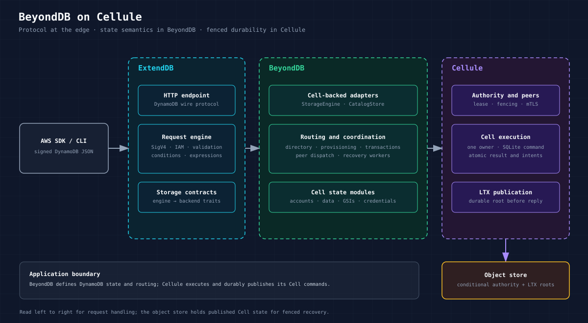
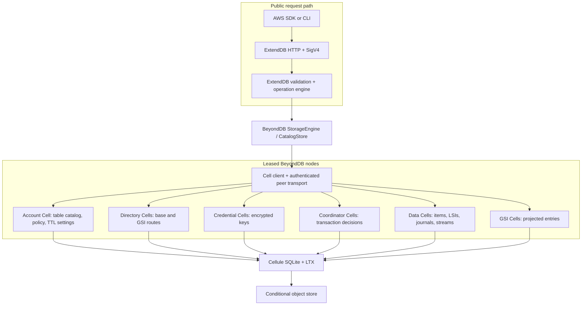
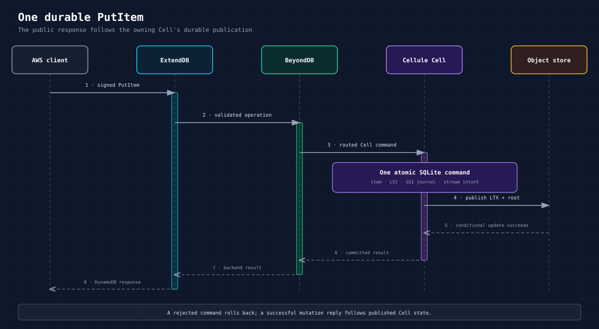
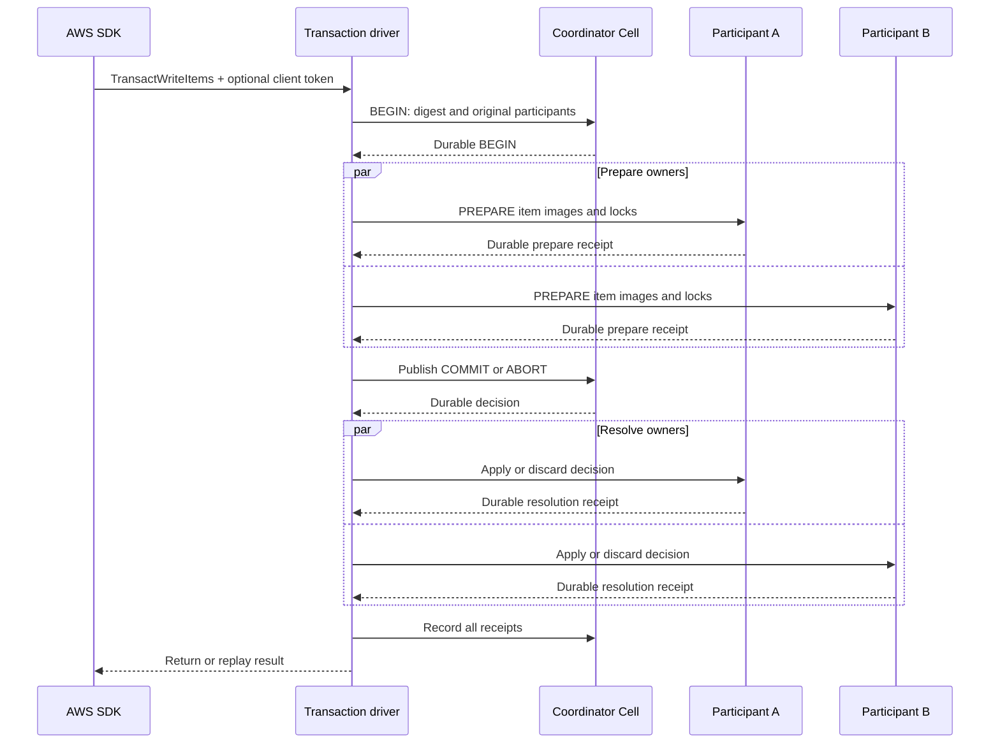
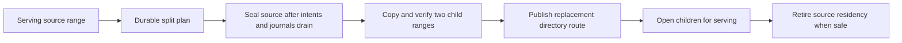
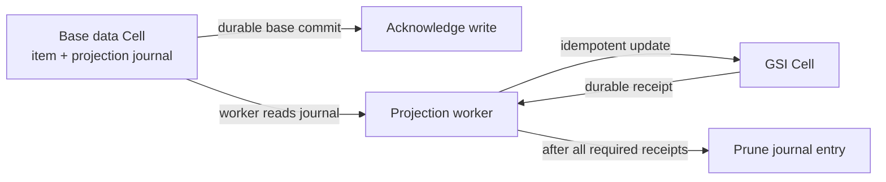
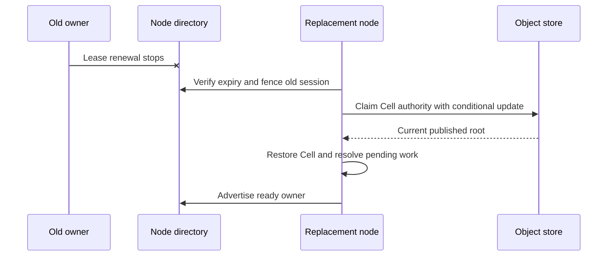

# Understand BeyondDB's architecture and durability

This page explains how a signed request becomes durable, which Cell owns each kind of state, and how another node recovers that state. BeyondDB uses two pinned projects: ExtendDB owns the DynamoDB protocol and security boundary; Cellule owns fenced execution and durable publication. BeyondDB connects them through Cell schemas, adapters, routing, provisioners, a transaction coordinator, and serving workers. The design does not establish fleet-scale performance.



The [full-size PNG](../diagram/beyonddb-architecture/layers@2x.png) is useful when a Markdown viewer does not render SVG. Read from top to bottom: ExtendDB validates the request, BeyondDB chooses an owner, and Cellule executes and publishes the result.

| Term | Meaning in this design |
| --- | --- |
| **Cell** | A single-writer, durable unit of state executed by Cellule. |
| **Owner** | The node currently authorized to execute a Cell. |
| **Route** | The table generation, hash range, and owner information used to find a Cell. |
| **LTX** | The published SQLite change format that lets a new owner restore a Cell. |
| **Fence** | An authority check that prevents an old owner or route from writing. |

## Components and ownership

The request path separates protocol work from state execution. The Cell types below have different ownership and recovery policies, even when they run on the same node.



The server uses an S3, GCS, or Azure object store and a separate scratch directory for each node session. The object store needs strict create and conditional updates for Cell authority. A public node can forward a signed request to a remote owner over mutual TLS (mTLS); the receiver still checks its authority. Preserve the encryption key file across restarts because it protects stored access secrets.

| State | Authority and atomic boundary |
| --- | --- |
| Account metadata and IAM policies | One account Cell command for each account-local mutation. The account still owns the table-name catalog and publication anchors. |
| Base items and LSIs | One data-range Cell owns a partition-key hash interval. A write, its LSI changes, GSI journal entry, and stream intent share one command. |
| GSIs | Separate range Cells receive journal projections asynchronously and idempotently. Their read view can lag a base write. |
| Transactions | One durable coordinator records a participant set and COMMIT or ABORT decision. Each account/data participant stores prepare state and resolves that decision idempotently. |
| Credentials | Key-derived credential Cells store encrypted secrets and session tokens. |

## Single-item write sequence

The owner commits the base mutation and its dependent records together. The client receives success after Cellule publishes the committed state.



```mermaid
sequenceDiagram
    participant Client as AWS SDK
    participant HTTP as ExtendDB endpoint
    participant Route as BeyondDB router
    participant Owner as Data Cell owner
    participant Store as Object store
    Client->>HTTP: Signed PutItem
    HTTP->>HTTP: SigV4, IAM, validation, expressions
    HTTP->>Route: StorageEngine.put_item
    Route->>Owner: Command for table generation and range epoch
    Owner->>Owner: Check condition; update item, LSI, journal, stream
    Owner->>Store: Publish LTX and current root
    Store-->>Owner: Conditional publication succeeds
    Owner-->>HTTP: Committed result
    HTTP-->>Client: DynamoDB JSON response
```

A rejected command rolls back its SQLite transaction. The router uses the current table generation, range, and owner epoch; the owner rejects stale routes so the router can refresh them. `GetItem`, `Query`, and `Scan` read the owning Cell and respect unresolved transaction intents.

## Cross-Cell transaction sequence

A cross-Cell transaction has one durable decision. Participant Cells store their prepared state and resolve that decision independently, so recovery can finish after a driver failure.



The original coordinator and participant identities survive routing changes. If a driver dies after publishing the decision, startup or serving recovery finishes participant resolution. A caller timeout leaves the outcome unknown until the durable decision is inspected. A client token distinguishes a matching replay from a different request. Transactional reads use shared key locks and captured images. See the [transaction protocol and failure cases](../CROSS_CELL_TRANSACTIONS.md).

## Range split and GSI projection

Splitting changes a route only after the source has sealed and both children have copied and verified its contents. Global secondary index (GSI) projection follows a different path: a base write commits a journal entry, then an index worker applies it asynchronously.



Split plans are durable and replayable. The source cannot seal while prepared
transactions or pending GSI projection work would be lost. Directory
publication retains the plan until both children open. The route identifies
the table generation, Cell owner, and epoch, so a stale source cannot accept
new work after cutover. `Scan` continuation and broad split behavior remain
under qualification; see [metadata ownership](../METADATA_SHARDING.md).

For a GSI, the base command writes an immutable projection journal entry. A worker applies a versioned entry or tombstone to the index Cell. It removes the journal entry only after every required index acknowledges it durably. An unavailable index delays its own projection while healthy indexes can advance. GSI reads are therefore eventually consistent with base writes; a base transaction does not produce an atomic GSI view. See the [GSI design and limits](../GLOBAL_INDEXES.md).



## Failure recovery and current limits

Recovery first establishes that the old owner has lost authority. The replacement then claims the published root and replays unfinished work before advertising readiness.



An unreachable owner with a live lease stays fenced against takeover.
Configured account and credential Cells are recovered at startup; requests
can restore published idle or expired data/GSI owners. Coordinator recovery
resolves abandoned work. A fleet-wide scheduler for unaccessed data-only
owners, bounded recovery time, sustained overload behavior, and safe storage
history collection remain open. The [scaling plan](../SCALING.md) defines the
10,000-Cell/multi-TB target and the measurements needed to claim it.

## Source map

Use these entry points to follow a diagram into the implementation:

| Boundary | Entry point |
| --- | --- |
| Public server composition | [`src/server.rs`](../src/server.rs) and [`src/bin/beyonddb.rs`](../src/bin/beyonddb.rs) |
| Table and item adapter | [`src/backend.rs`](../src/backend.rs) and [`src/backend/data.rs`](../src/backend/data.rs) |
| Cell routing and ownership | [`src/routing.rs`](../src/routing.rs), [`src/directory.rs`](../src/directory.rs) |
| Transaction driver and coordinator | [`src/backend/transaction.rs`](../src/backend/transaction.rs), [`src/transaction_coordinator.rs`](../src/transaction_coordinator.rs) |
| GSI projection | [`src/global_index.rs`](../src/global_index.rs), [`src/backend/global_index.rs`](../src/backend/global_index.rs) |
| Stream journal, reads, and retention | [`src/stream_journal.rs`](../src/stream_journal.rs), [`src/backend/streams.rs`](../src/backend/streams.rs), [`src/backend/stream_retention.rs`](../src/backend/stream_retention.rs) |
